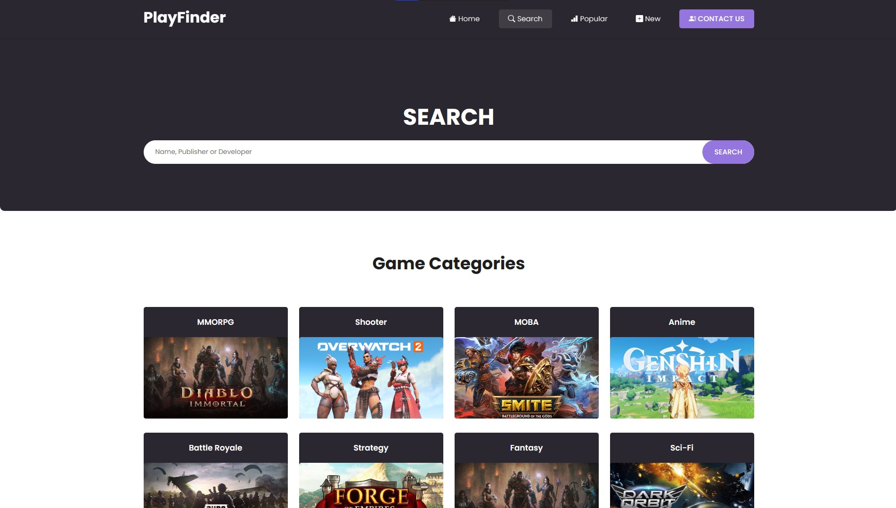
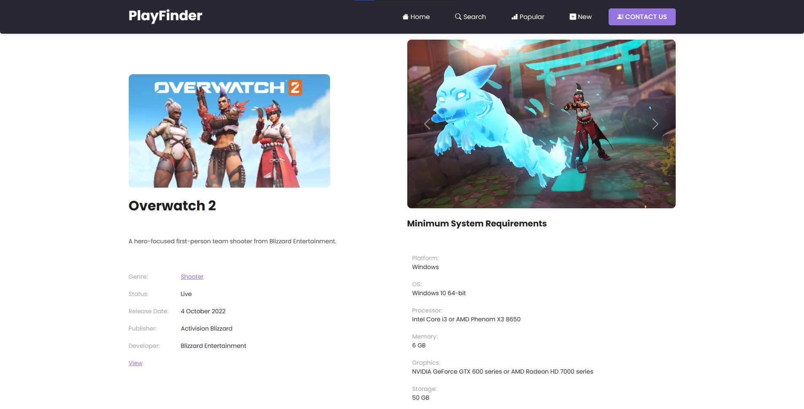

# PlayFinder

"PlayFinder" is a website powered by the Free-To-Play Games Database API, enabling users to find, explore, and play a diverse selection of free-to-play video games effortlessly. It's your go-to platform for discovering and enjoying free gaming experiences.

## Features

- Browse a diverse selection of free-to-play video games.
- Explore games by categories such as MMORPG, Shooter, MOBA, and more.
- Search for games by name, publisher, or developer.
- View details of individual games, including screenshots and descriptions.
- Stay updated with popular and new games in the gaming world.

## Technologies Used

- HTML5
- CSS3
- Bootstrap 5
- JavaScript
- jQuery

## Acknowledgments

- [Free-To-Play Games Database API](https://www.freetogame.com/api-doc): Thank you for providing access to a vast collection of free-to-play games.

## Live View
- https://terrytim.github.io/play-finder/

---

